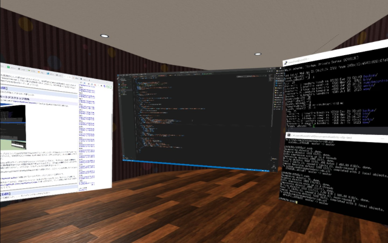
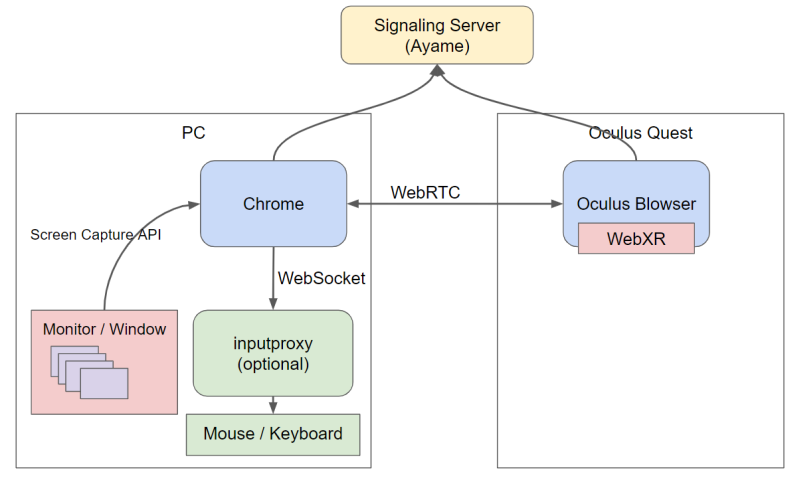

# WebRTC + WebXR Remote Desktop

WebRTCとWebXRを使ったブラウザ上で動作するリモートデスクトップです．



最近の Chrome や Edge で動くはずです．VRモードと通常表示が可能です．
VRモードは Oculus Quest 2 の Oculus Browser で動作確認しています．

Demo URL:
- https://binzume.github.io/webrtc-rdp/
- https://binzume.github.io/vr-workspace/#app:app-webrtc-rdp (WebXR)

## Usage

1. ブラウザで https://binzume.github.io/webrtc-rdp/ にアクセスするか，または下記のアプリを起動してください
2. 接続したいブラウザ間でペアリングします．片方のブラウザでPINを生成し，もう一方のブラウザでそのPINを入力してください (初回のみ)
3. 「Share Desktop」または「Share Camera」ボタンで共有したいストリームを選択してください (ブラウザ版のみ)
4. 「Open Remote Desktop」ボタンをクリックすると，相手側のデスクトップに接続します．複数のストリームがある場合は選択画面が表示されます

- [WebXR](https://binzume.github.io/vr-workspace/#app:app-webrtc-rdp) リンクから VR モードでPCのデスクトップに接続できます (Oculus Quest用)
- 最低限の動作確認のためのデモなので，本格利用する場合は色々いじってください．

### Mouse/Keyboard

マウスやキーボードを使いたい場合は，下記のElectron App版を使ってください．

ブラウザ上からはマウスやキーボードの制御はできないので，ワイヤレスキーボード・マウス等の手段を用意するか，
どうしてもブラウザ経由でマウスを動かしたい場合は，ホスト側のPCで https://github.com/binzume/inputproxy を起動し表示されたURLをフォームに入力することで使えるようになります．

### ファイル共有

ホスト側の画面にファイルやディレクトリをドラッグ＆ドロップすると共有されます．

- WebXR版のクライアントの `Storage` に追加されます
- まだWebXR以外のUIを用意してないです

## Electron App

Chromeを起動していなくても単体で動くアプリケーションです．マウスやキーボードも使えます．

[Releases](https://github.com/binzume/webrtc-rdp/releases/latest)ページからWindows用のインストーラがダウンロードできます．

インストールせずに利用する場合や開発時は以下のように起動してください．

```
git clone https://github.com/binzume/webrtc-rdp.git
cd webrtc-rdp/electron
npm install
npx electron-rebuild
npm start
```

Node.jsのネイティブモジュールのビルドができる環境が必要です．
`npm run build-win` で実行ファイルをビルドできます．
MacOSやLinuxでも動くように実装していますが，Windowsでのみで動作確認しています．

# Design



## WebRTC

- WebRTC Signaling Serverは[OpenAyame/ayame](https://github.com/OpenAyame/ayame)を使います
- デモの実装では[Ayame Labo](https://ayame-labo.shiguredo.jp/)に接続します．本格利用する場合は自分でAyameを動かしたほうが良いです

## VR

- [A-Frame](https://aframe.io/)を使っています．
- [単体](https://binzume.github.io/webrtc-rdp/webxr/)でも使えますが，[binzume/vr-workspace](https://github.com/binzume/vr-workspace)内のアプリとして読み込む前提の作りになっています

Oculus Touchコントローラーのボタン割当:

- Trigger: 左クリック
- Aボタン: 中クリック
- Bボタン: 右クリック
- Grip＆ドラッグ: デスクトップ内のウインドウを分離して表示 (ホストがElectron Appの場合のみ)

## Security

- P2Pなので，同じネットワーク内で使う場合は共有している映像や音声などはインターネットを経由しません．
- デモの実装ではAyame Laboを使って接続します．セキュアな接続が必要な場合は自分の環境でAyameを起動して使ってください．
- 接続にAyame Laboを使っている場合，何らかの理由でRoomIdが漏れると他者が接続できる可能性があるので，接続を待機した状態で放置しないでください．
- RoomIdはPINの交換時にランダムな文字列から生成して共有します．

## TODO

- WebXR時にレンダリング面積に合わせて元のvideo解像度を変える
- クリップボード共有機能

## License

MIT
